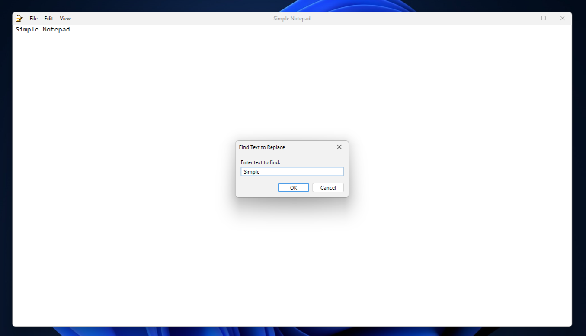

# Simple Notepad - A Java Swing Notepad Application

   

## About
Made with: Java, Java Swing, Flatlaf
- An easy to use and bloatfree notepad application.
- Light and Dark Modes.
- Font changer that allows you to change the font, style, and size of the font.
- Find function that allows you to search for a specific word to highlight.
- Replace function that allows you to seach for a specific word and replace it with another word.
- Save and open dialog boxes.
- Undo, Redo, Cut, Copy, Paste, Delete, and Select All functions.
- Word Wrap mode that you can toggle on or off.
- Various keyboard shortcuts for functions.

## Requirements
Java JDK Requirments: JDK 21

## Run the Application
To run the application download the latest release and run the .jar file. Alternatively you can clone the source code and build/run the program.

## Photos

###

###

###

###

###

###

###

###
